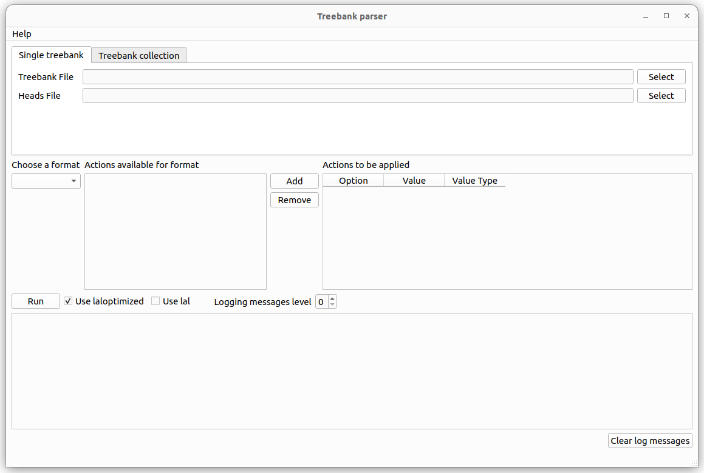
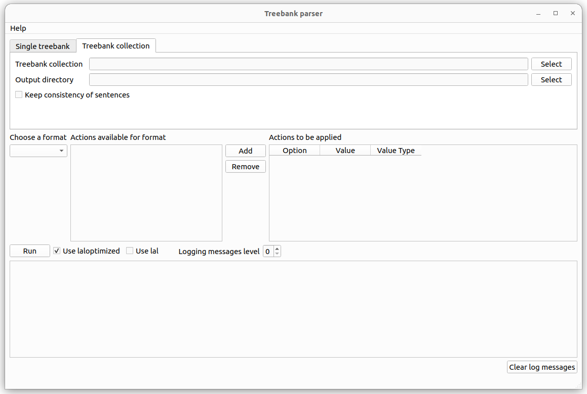

# Treebank parser

This repository contains a python application that parses treebanks and converts them into the _head vector_ format. It can also parse a file containing only head vectors and apply some basic filtering operations on those trees. This python application can be used via a Command Line Interface (CLI) and a Graphical User Interface (GUI). This uses LAL (the [Linear Arrangement library](https://github.com/LAL-project/linear-arrangement-library)).

This branch of _treebank-parser_ uses the [latest LAL](https://github.com/LAL-project/linear-arrangement-library/).

## Head vectors

The _head vector_ format is very easy to understand: a single head vector can represent the underlying tree structure of a single syntactic dependency structure. It does so in the form of a vector of whole, non-negative numbers. In these vectors, every number occupies a position from `1` to `n` (where `n` is the number of vertices of the tree) and indicates the parent vertex for the vertex at the corresponding position. The number `0` represents the root of the tree (that is, the corresponding vertex has no parent); the other numbers represent the _head_ (or _parent_) of the vertex at the corresponding position in the vector.

For example, the head vector

	0 1 1 1 1 1 1
    
represents the simple structure of a _star tree_:

Those familiar with the Universal Dependencies format are already accostumed to dealing with _heads_. Consider the following phrase (taken from [UD English](https://github.com/UniversalDependencies/UD_English-PUD/blob/master/en_pud-ud-test.conllu)).

	# sent_id = n01002042
	# text = The new spending is fueled by Clinton's large bank account.
	1  The      the      DET   DT   Definite=Def|PronType=Art                             3  det        3:det	      _
	2  new      new      ADJ   JJ   Degree=Pos                                            3  amod       3:amod	      _
	3  spending spending NOUN  NN   Number=Sing                                           5  nsubj:pass 5:nsubj:pass _
	4  is       be       AUX   VBZ  Mood=Ind|Number=Sing|Person=3|Tense=Pres|VerbForm=Fin 5  aux:pass   5:aux:pass   _
	5  fueled   fuel     VERB  VBN  Tense=Past|VerbForm=Part                              0  root       0:root       _
	6  by       by       ADP   IN   _                                                     11 case       11:case      _
	7  Clinton  Clinton  PROPN NNP  Number=Sing                                           11 nmod:poss  11:nmod:poss SpaceAfter=No
	8  's       's       PART  POS  _                                                     7  case       7:case       _
	9  large    large    ADJ   JJ   Degree=Pos                                            11 amod       11:amod      _
	10 bank     bank     NOUN  NN   Number=Sing                                           11 compound   11:compound  _
	11 account  account  NOUN  NN   Number=Sing                                           5  obl        5:obl:by     SpaceAfter=No
	12 .        .        PUNCT .    _                                                     5  punct      5:punct      _

The head vector of this sentence can be found at the 7th column:

	3 3 5 5 0 11 11 7 11 11 5 5

One way to visualize it is:

(figures made with [IPE](https://ipe.otfried.org/) and the [ipe.embedviz](https://github.com/lluisalemanypuig/ipe.embedviz) ipelet)

## Dependencies

The application is built on (and thus, depends on) the [Linear Arrangement library](https://github.com/LAL-project/linear-arrangement-library). The library must be installed on the system and Python should be able to find it in its path.

## Usage of the Graphical User Interface (GUI)

The GUI was designed with simplicity in mind. Here is a screenshot.

The usage can be read by clicking, on the menu bar, `Help` > `How to`. A small pop up window will show up on your screen with the following message:

	How to use this GUI:
	
	First, find the treebank input file (when working with a single treebank) or the
	treebank collection main file (when working with a treebank collection) by using
	the appropriate 'select' button to the right of the interface in the appropriate
	tab. Then, select the output file or directory.
	
	After this, select the correct format of the input treebank file. If the input
	file is in CoNLL-U format, then choose 'CoNLL-U' in the dropdown button below
	'Choose a format'. A list of actions will appear next to that button. Select
	the action(s) you want to be performed on the treebank and then click 'Add'
	so that it actually takes effect. The meaning of every actoin will appear if
	you hover the mouse over them in a tooltip text. If any action needs a value
	associated to it, the table next to it will indicate in its third column the
	data type of the value (e.g., 'Integer'). Fill the cell in the second column
	with an appropriate value of the corresponding data type. If an action does
	not need a value, the third column will be empty
	
	Once all the actions have been chosen, you can click 'Run' to actually transform
	the input treebank file into a head vector file. Optionally, you can tell the
	parser to use a debug compilation of the Linear Arrangement Library by checking
	the checkbox 'Use lal'.

### Requirements for running the GUI

The GUI was built with [PySide6](https://pypi.org/project/PySide6/). Anaconda users can install it with the following command ([here](https://anaconda.org/conda-forge/pyside6) are listed alternative ways of installing PySide6 with conda.)

	$ conda install conda-forge::pyside6 

`pip3` users can run the following command in their command line terminal to install PySide6

	$ pip3 install PySide6

### Running the GUI

Simply, run the `gui/main.py` file. For example, from the command line:

	$ cd treebank-parser/
	$ python3 gui/main.py

#### Running the GUI with 'lal'

The GUI loads the release distribution of LAL by default. To run it, run

	$ cd treebank-parser/
	$ python3 gui/main.py

To make the GUI load the debug distribution, run

	$ cd treebank-parser/
	$ python3 gui/main.py --lal

## Usage of the Command Line Interface (CLI)

The usage of the CLI is explained by examples.

### Examples of usage

In the following examples, the input file is always the `CoNLL-U`-formatted file `catalan.conllu`, and the output file is always `catalan.heads`. Notice that the order of the parameters is important! The treebank format keyword (e.g. `CoNLL-U`) must go after the parameters of the treebank parser program (in the examples, `-i` and `-o`) and before the preprocessing flags (in the examples, `--RemovePunctuationMarks` and `--RemoveFunctionWords`).

- Convert the input treebank file into head vectors

		$ python3 cli/main.py -i catalan.conllu -o catalan.heads CoNLL-U

- Remove punctuation marks from the sentences in the input treebank file

		$ python3 cli/main.py -i catalan.conllu -o catalan.heads CoNLL-U --RemovePunctuationMarks

- Remove function words from the sentences in the input treebank file

		$ python3 cli/main.py -i catalan.conllu -o catalan.heads CoNLL-U --RemoveFunctionWords

- Remove function words AND punctuation marks from the sentences in the input treebank file

		$ python3 cli/main.py -i catalan.conllu -o catalan.heads CoNLL-U --RemoveFunctionWords --RemovePunctuationMarks

### Parameters (summary)

Required parameters:

- When processing a single treebank:

	- `-i input, --input-treebank-file input`: specifies the input treebank file that is to be parsed.
	- `-o outfile, --output outfile`: specifies the name of the output file, namely, the file that will contain the result of parsing the treebank.

- When processing a treebank collection

	- `-t input, --input-treebank-collection input`: specifies the input treebank collection main file that is to be parsed.
	- `-o directory, --output directory`: specifies the name of the output directory, namely, the directory where the head vector files will be stored.

Format parameters:

- `CoNLL-U`: parse a CoNLL-U-formatted file.
- `Head-Vector`: parse a head-vector-formatted file.

Optional interesting parameters:

- `-c, --consistency-in-sentences`: When processing a treebank collection, a sentence of a treebank will not be written to the output if the equivalent sentence in another treebank is discarded.
- `--lal`: execute the program using the debug compilation of LAL.
- `--verbose l`: set the level of verbosity of the program; the higher the value, the more messages the application will output. These messages are of X kinds:
	- `CRITICAL` error messages (always displayed),
	- `ERROR` messages (always displayed),
	- `WARNING` messages (displayed at `l >= 1`),
	- `INFO` messages (displayed at `l >= 2`),
	- `DEBUG` messages (displayed at `l >= 3`).

### Documentation of the main parameters

All the parameters that the application needs can be queried using the `--help` parameter. The output is the following:

	usage: main.py [-h] (-i input_treebank_file | -t input_treebank_collection) [-c] -o output
	               [--verbose VERBOSE] [--lal] [--quiet]
	               {CoNLL-U,Stanford,Head-Vector} ...
	
	Parse a treebank file and extract the sentences as head vectors. The format of the treebank file is
	specified with a positional parameter (see the list of positional arguments within "{}" below).
	
	positional arguments:
	  {CoNLL-U,Stanford,Head-Vector}
	                        Choose a format command for the input treebank file.
	    CoNLL-U             Command to parse a CoNLL-U-formatted file. For further information on this
	                        format's detailed specification, see
	                        https://universaldependencies.org/format.html.
	    Stanford            Command to parse a Stanford-formatted file. For further information on this
	                        format's detailed specification, see
	                        https://nlp.stanford.edu/software/stanford-dependencies.html.
	    Head-Vector         Command to parse a head vector-formatted file. For further information on this
	                        format's detailed specification, see https://cqllab.upc.edu/lal/data-formats/.
	
	options:
	  -h, --help            show this help message and exit
	  -i input_treebank_file, --input-treebank-file input_treebank_file
	                        Name of the input treebank file to be parsed.
	  -t input_treebank_collection, --input-treebank-collection input_treebank_collection
	                        Name of the input treebank collection to be parsed.
	  -c, --consistency-in-sentences
	                        When processing a treebank collection, a sentence of a treebank will not be
	                        written to the output if the equivalent sentence in another treebank is
	                        discarded.
	  -o output, --output output
	                        If a single treebank file was passed, this is the name of the output .heads
	                        file. If a treebank collection was passed, this is the output directory.
	  --verbose VERBOSE     Output logging messages showing the progress of the script. The higher the
	                        debugging level the more messages will be displayed. Default level: 0 --
	                        display only 'error' and 'critical' messages. Debugging levels: * 1 -- messages
	                        from 0 plus 'warning' messages; * 2 -- messages from 1 plus 'info' messages; *
	                        3 -- messages from 2 plus 'debug' messages;
	  --lal                 Use the debug compilation of LAL ('import lal'). The script will run more
	                        slowly, but errors will be more likely to be caught. Default: 'import
	                        laloptimized as lal'.
	  --quiet               Disable non-logging messages.

#### CoNLL-U parameter documentation

All the parameters accepted by the CoNLL-U format parser are documented [here](docs/CoNLL-U.md).

#### Stanford parameter documentation

All the parameters accepted by the Stanford format parser are documented [here](docs/Stanford.md).

#### Head-Vector parameter documentation

All the parameters accepted by the "head vector" format parser are documented [here](docs/head_vector.md).
