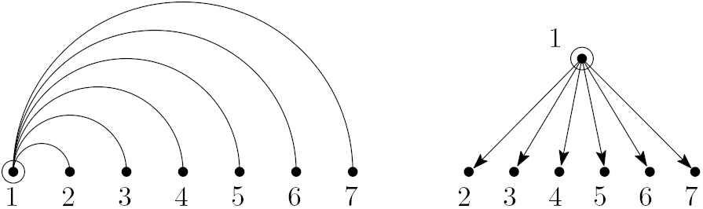

# Treebank parser

This repository contains a small python application that parses treebanks and converts them into the _head vector_ format so that LAL (the [Linear Arrangement library](https://github.com/LAL-project/linear-arrangement-library)) can process them.

## Head vectors

The _head vector_ format is very easy to understand: a single head vector can represent the underlying tree structure of a single syntactic dependency structure. It does so in the form of a vector of whole, non-negative numbers. In these vectors, every number occupies a position from `1` to `n` (where `n` is the number of vertices of the tree) and indicates the parent vertex for the vertex at the corresponding position. The number `0` represents the root of the tree (that is, the corresponding vertex has no parent); the other numbers represent the _head_ (or _parent_) of the vertex at the corresponding position in the vector.

For example, the head vector

	0 1 1 1 1 1 1
    
represents the simple structure of a _star tree_:

Those familiar with the Universal Dependencies format are already accostumed to dealing with _heads_. Consider the following phrase (taken from [UD English](https://github.com/UniversalDependencies/UD_English-PUD/blob/master/en_pud-ud-test.conllu)).

	# sent_id = n01002042
	# te  xt = The new spending is fueled by Clinton’s large bank account.
	1	The	the	DET	DT	Definite=Def|PronType=Art	3	det	3:det	_
	2	new	new	ADJ	JJ	Degree=Pos	3	amod	3:amod	_
	3	spending	spending	NOUN	NN	Number=Sing	5	nsubj:pass	5:nsubj:pass	_
	4	is	be	AUX	VBZ	Mood=Ind|Number=Sing|Person=3|Tense=Pres|VerbForm=Fin	5	aux:pass	5:aux:pass	_
	5	fueled	fuel	VERB	VBN	Tense=Past|VerbForm=Part	0	root	0:root	_
	6	by	by	ADP	IN	_	11	case	11:case	_
	7	Clinton	Clinton	PROPN	NNP	Number=Sing	11	nmod:poss	11:nmod:poss	SpaceAfter=No
	8	’s	’s	PART	POS	_	7	case	7:case	_
	9	large	large	ADJ	JJ	Degree=Pos	11	amod	11:amod	_
	10	bank	bank	NOUN	NN	Number=Sing	11	compound	11:compound	_
	11	account	account	NOUN	NN	Number=Sing	5	obl	5:obl:by	SpaceAfter=No
	12	.	.	PUNCT	.	_	5	punct	5:punct	_

The head vector of this sentence can be found at the 7th column:

	3 3 5 5 0 11 11 7 11 11 5 5

One way to visualize it is:

(figures made with [IPE](https://ipe.otfried.org/) and the [ipe.embedviz](https://github.com/lluisalemanypuig/ipe.embedviz) ipelet)

## Dependencies

The application is built on (and thus, depends on) the [Linear Arrangement library](https://github.com/LAL-project/linear-arrangement-library). The library must be installed on the system and Python should be able to find it in its path.

## Usage of the application

This application has no GUI (Graphical User Interface). Usage of the command line is required.

### Examples of usage

In the following examples, the input file is always the `CoNLL-U`-formatted file `catalan.conllu`, and the output file is always `catalan.heads`:

- Convert the input treebank file into head vectors

		python3 treebank_parser.py -i catalan.conllu -o catalan.heads -f CoNLLU

- Remove punctuation marks from the sentences in the input treebank file

		python3 treebank_parser.py -i catalan.conllu -o catalan.heads -f CoNLLU --actions RemovePunctuationMarks

- Remove function words from the sentences in the input treebank file

		python3 treebank_parser.py -i catalan.conllu -o catalan.heads -f CoNLLU --actions RemoveFunctionWords

- Remove function words AND punctuation marks from the sentences in the input treebank file

		python3 treebank_parser.py -i catalan.conllu -o catalan.heads -f CoNLLU --actions RemoveFunctionWords RemovePunctuationMarks

### Parameters (summary)

Required parameters:

- `-i infile, --inputfile infile`: specifies the input treebank file that is to be parsed.
- `-o outfile, --outputfile outfile`: specifies the name of the output file, namely, the file containing the head vectors.
- `-f format, --format format`: the format of the input treebank file. Read the help below to see the list of supported formats.

Optional interesting parameters:

- `--actions`: list of actions to be performed on each **individual** syntactic dependency structure. Read the help below to see the list of supported actions. These actions are not applied in any particular order.

Other optional parameters:

- `--laldebug`: execute the program using the debug compilation of LAL.
- `--verbose`: set the level of verbosity of the program; the higher the value, the more messages the application will output. These messages are of X kinds:
	- `CRITICAL` error messages (always displayed),
	- `ERROR` messages (always displayed),
	- `WARNING` messages (displayed at `>= 1`),
	- `INFO` messages (displayed at `>= 2`),
	- `DEBUG` messages (displayed at `>= 3`).

### Full parameter documentation

All the parameters that the application needs can be queried using the `--help` parameter. The output is the following:

	usage: treebank_parser.py [-h] -i infile -o file -f format [--verbose VERBOSE] [--laldebug] [--actions [action [action ...]]]
	
	Parse a CoNLL-formatted file and extract the sentences as head vectors.
	
	optional arguments:
	  -h, --help            show this help message and exit
	  -i infile, --inputfile infile
	                        Name of the input treebank file to be parsed.
	  -o outfile, --outputfile outfile
	                        Name of the output .heads file.
	  -f format, --format format
	                        The format of the input treebank. Choices: ['CoNLLU']
	  --verbose VERBOSE     Output logging messages showing the progress of the script. The higher thedebugging level the more
	                        messages will be displayed. Default level: 0 -- display only 'error' and 'critical' messages. Debugging
	                        levels: * 1 -- messages from 0 and 'warning' messages; * 2 -- messages from 1 and 'info' messages; * 3 --
	                        messages from 2 and 'debug' messages;
	  --laldebug            Use the debug compilation of LAL ('import laldebug as lal'). The script will run more slowly, but errors
	                        will be more likely to be caught. Default: 'import lal'.
	  --actions [action [action ...]]
	                        Type of actions to be run on the input data for every tree. Choices:
	                        ['RemovePunctuationMarks', 'RemoveFunctionWords'].

